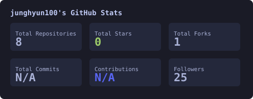
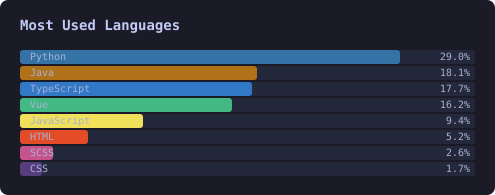
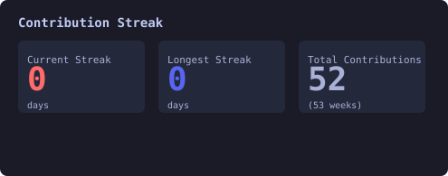
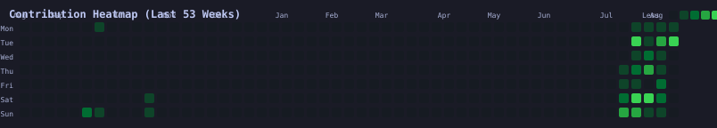

# 안녕하세요. 개발자 백정현입니다! 👋

### 📊 GitHub Stats

<table align="center">
  <tr>
    <td></td>
    <td></td>
  </tr>
</table>

---

### 🔥 Contribution Streak

<table align="center">
  <tr>
    <td></td>
  </tr>
</table>

---

### 📈 Contribution Heatmap (Auto-updated via GitHub Actions)

<table align="center">
  <tr>
    <td></td>
  </tr>
</table>

---

  

  📍 Seoul, KR · 💼 Backend Engineer · 🌱 Study Recorder · Always Learning

---

  
<b>🤖 This profile is auto-updated via GitHub Actions</b>

   
  Stats & heatmap refresh daily at 06:17 KST · <a href=".github/workflows/generate-svgs.yml">View workflow</a>

